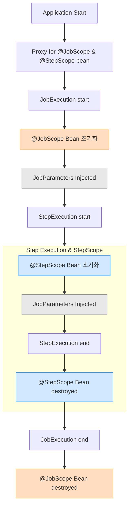

# Session 2-2

# JobParameters
JobParameters를 통해 Batch 실행값을 동적으로 결정한다. 어떤 조건에서 어떤 데이터를 다룰지 결정하는 역할

- 프로퍼티(-D 옵션)와 JobParameters의 차이
  - 입력값 동적 변경 : 온라인 배치 앱(웹 요청에 의한 비동기 배치 job 실행)의 경우 프로퍼티로 불가능
  - 메타데이터 : JobParameters의 모든 값을 메타데이터 저장소에 기록. 실행 이력 추적 혹은 재시작 처리할때 중요한 기능을 제공한다.

## JobParamters 전달
### Job을 실행시키는 여러 방식
- 커맨드라인 실행
- REST API를 통해 외부시스템에서 트리거
- 메시지 큐에서 메시지가 도착했을때 실행
- 비즈니스 이벤트가 발생했을때 실행 (파일업로드, 주문 등)
- @Schedule 태스크 실행
</br>
Batch 실행 방식에 따라 JobParamter를 전달하는 방법은 크게 `커맨드라인 전달`과 `프로그래밍 방식 전달`로 나눌 수 있다.

### ✏ 커맨드라인에서 전달하기
실제 운영 환경에서는 커맨드 라인을 통해 전달하는 방식이 핵심(대부분 스케줄러와 자동화 도구들이 커맨드라인을 기본 지원)

```shell
./gradlew bootRun --args='--spring.batch.job.name=dataProcessingJob inputFilePath=/data/input/users.csv,java.lang.String'
```
> `--`로 시작하는 Spring Boot 파라미터와 Spring Batch 잡 파라미터를 구분하라  
> `--spring.batch.job.name=dataProcessingJob`은 실행할 Job 이름을 지정하는 Spring Boot 아규먼트이며, 그 뒤에 key=value,type들은 실제 Job에 주입되는 Spring Batch JobPrameters이다.
</br>

### JobParamters 기본 표기법
```
parameterName=parameterValue,parameterType,identificationFlag
```
- parameterName : 배치 Job에서 파라미터를 찾을 때 사용할 Key. 해당 이름으로 파라미터에 접근
- parameterValue : 실제 파라미터 값
- parameterType : 파라미터의 타입(`java.lang.String`, `java.lang.Integer`와 같은 fully qualified name 사용).
  - 파라미터 타입을 명시하지 않을 경우 해당 파라미터를 String으로 간주한다.
  - 문자열로 전달된 JobParameters는 Spring Batch의 DefaultJobParametersConverter라는 컴포넌트를 통해 적절한 타입으로 변환
- identificationFlag : 해당 파라미터가 JobInstance 식별에 사용될 파라미터인지 여부 전달. 생략이 가능하며 기본값은 `true`
</br>

### JobParamters 타입
- 기본형 (정수형, 문자열)
```java
@Value("#{jobParameters['terminatorId']}") String terminatorId, 
@Value("#{jobParameters['targetCount']}") Integer targetCount
```
- 날짜와 시간 (LocalDate, LocatDateTime)
```java
@Value("#{jobParameters['executionDate']}") LocalDate executionDate,
@Value("#{jobParameters['startTime']}") LocalDateTime startTime
```
날짜/시간 파라미터를 전달할때는 특정 형식을 사용해야한다. (`ISO_LOCAL_DATE`, `ISO_LOCAL_DATE_TIME `)
```shell
./gradlew bootRun --args='--spring.batch.job.name=terminatorJob executionDate=2024-01-01,java.time.LocalDate startTime=2024-01-01T14:30:00,java.time.LocalDateTime'
```
- 열거형
```shll
./gradlew bootRun --args='--spring.batch.job.name=terminatorJob questDifficulty=HARD,com.system.batch.QuestDifficulty'
```
type으로 해당 enum class를 기재

| `@Value`로 값을 받기 위해서 `@StepScope`와 같은 특별한 어노테이션과 함께 해야한다.
| 파라미터의 타입만 적절히 전달하면 별도의 변환 로직 없이 DefaultJobParametersConverter가 알아서 변환해준다.

</br>

### POJO를 활용한 주입
복잡한 배치 작업에서는 여러 개의 Job 파라미터를 효율적으로 관리하기 위해 별도의 클래스를 만들어 파라미터를 관리하고 코드의 구조화와 재사용성을 높일 수 있다.
```java
@Data
@StepScope
@Component
public class SystemInfiltrationParameters {
    @Value("#{jobParameters[missionName]}")
    private String missionName;
    private int securityLevel;
    private final String operationCommander;
    
    public SystemInfiltrationParameters(@Value("#{jobParameters[operationCommander]}") String operationCommander) {
        this.operationCommander = operationCommander;
    }
    
    @Value("#{jobParameters[securityLevel]}")
    public void setSecurityLevel(int securityLevel) {
        this.securityLevel = securityLevel;
    }
}
```
- `@Component`로 bean 등록
- Scope 어노테이션 선언
- `@Value` 방식으로 주입 -> 필드 직접 주입/ 생성자 파라미터 주입/ setter 메소드 주입
</br>

### 파라미터 표기법의 한계와 JSON 기법 표기법
*파라미터 표기법에는 한계가 있는데 구분자로 쉼표(`,`)를 사용하기 때문에 value에 쉼표가 포함되면 값이 짤리고 오류가 발생한다*
이러한 한계를 보안하기 위해 Spring Batch 5부터 Json 기반 표기법을 제공한다.
```
infiltrationTargets='{"value": "판교_서버실,안산_데이터센터", "type": "java.lang.String"}'
```

- **의존성 추가**
```
dependencies {
    implementation 'org.springframework.boot:spring-boot-starter-json'
}
```
- **bean 등록**
```
@Bean
public JobParametersConverter jobParametersConverter() {
    return new JsonJobParametersConverter();
}
```
`DefaultJobParametersConverter`를 계승한 클래스

- **명령어**
```
./gradlew bootRun --args="--spring.batch.job.name=terminatorJob infiltrationTargets='{\"value\":\"판교서버실,안산데이터센터\",\"type\":\"java.lang.String\"}'"
```
혹은
```
java -jar kill-batch-system-0.0.1-SNAPSHOT.jar --spring.batch.job.name=terminatorJob infiltrationTargets='{"value":"판교_서버실,안산_데이터센터","type":"java.lang.String"}'
```

표기법 구성 요소들은 기본 표기법과 동일.
</br>

### 동작 원리
어플리케이션이 시작될때 `JobLauncherApplicationRunner` 컴포넌트가 자동 동작 (Spring Boot의 `ApplicationRunner`의 한 종류)

`JobLauncherApplicationRunner`의 처리 과정
1. Spring Boot에 의해 ApplicationContext에 등록된 모든 Job 타입 bean이 `JobLauncherApplicationRunner`으로 자동 주입
2. 유효성 검증으로 대상 job을 찾는다
   - 컨텍스트에 Job 타입 빈이 여러개인데 `--spring.batch.job.name`을 지정하지 않은 경우
   - `--spring.batch.job.name`으로 전달한 Job을 찾을 수 없는 경우
3. 커맨드라인으로 전달한 값들을 파싱해 JobParameters로 변환
4. Job 실행 : JobLauncher(Job을 실행시키는 컴포넌트)를 통해 앞서 찾은 Job을 JobParameters와 함께 실행시킨다
```java
this.jobLauncher.run(job, parameters);
```
</br>

### ✏ 프로그래밍 방식으로 전달
JobParametersBuilder 컴포넌트로 JobParameters를 생성한다.
```java
JobParameters jobParameters = new JobParametersBuilder()
    .addJobParameter("inputFilePath", "/data/input/users.csv", String.class)
    .toJobParameters();

jobLauncher.run(dataProcessingJob, jobParameters);
```
</br>

## JobParamters 접근
Spring Batch에서는 **JobExecution**이 Job의 실행 정보를 쥐고 있으며 JobParameters 또한 해당 객체에 저장된다.
JobParameters에 직접 접근하기 위해서 JobExecution를 통해야함

```java
public class CustomTasklet implements Tasklet {
   @Override
   public RepeatStatus execute(StepContribution contribution, ChunkContext chunkContext) {
       JobParameters jobParameters = chunkContext.getStepContext()																			            
                .getStepExecution()																				      
                .getJobParameters();
       
       String targetSystem = jobParameters.getString("system.target");
       long destructionLevel = jobParameters.getLong("system.destruction.level");
       
       log.info("타겟 시스템: {}", targetSystem);
       log.info("파괴 레벨: {}", destructionLevel);
       
       return RepeatStatus.FINISHED;
   }
}
```

StepExecution은 Step의 실행 정보를 담고 있는 객체이며 내부적으로 JobExecution을 참조한다. 


## JobParametersValidator
JobParametersValidator를 사용하면 잘못된 파라미터를 선별할 수 있다.
- Spring Batch에서 **DefaultJobParametersValidator** 제공

# Scope
Spring Batch에서는 일반적인 Spring 애플리케이션의 기본 스코프인 싱글통과 다른 특별한 스코프를 제공한다. 
**JobScope**와 **StepScope**가 선언된 빈은 애플리케이션 구동 시점에는 *프록시 객체*로 존재하고 그 후 Job이나 Step이 실행된 후 접근을 시도하면 그 때 실제 빈이 생성딘다.


런타임에 결정되는 JobParameters를 실행 시점에 정확하게 주입받고 동시에 여러 Job이 실행되더라도 각각 독립적인 빈을 사용하게되어 도시성 문제도 해결할 수 있다.  
또한, Job이나 Step 실행이 끝나면 해당 빈도 함게 제거되므로, 불필요한 메모리 점유가 없어 리소스 측면에서도 효율적이다.

## @JobScope
Job이 실행될 때 실제 빈이 생성되고, Job이 종료될 때 함께 제거되는 스코프. JobExecution과 생명주기를 같이 한다.  
- 지연된 Bean 생성 (Lazy Bean Creation)
- 어플리케이션 실행 중 전달되는 JobParameters(동적 JobParameters)를 Job 실행시점에 주입시킬 수 있다.
- 병렬처리 지원 -> REST API로 Job을 요청할때 쓰레드마다 Bean에 다른 값을 적용시킬 수 있다

## @StepScope
 @JobScope와 동일한 방식으로 동작하지만 적용 범위가 다르다. 


## JobScope와 StepScope 사용 시 주의사항
### 1. 프록시 대상 타입이 클래스인 경우 반드시 상속 가능한 클래스여야한다.
```java
@Scope(value = "job", proxyMode = ScopedProxyMode.TARGET_CLASS)
@Retention(RetentionPolicy.RUNTIME)
@Documented
public @interface JobScope {}
```
스코프들은 CGLIB를 사용해 클래스 기반의 프록시를 생성하기 때문에 대상 클래스가 상속 가능해야한다.

### 2. Step 빈에는 @StepScope와 @JobScope 사용불가
Step 빈에는 @StepScope 사용시 Step 빈 생성과 스코프 활성화 시점이 맞지 않아 오류가 발생한다. (Step이 실행되어야 StepScope가 활성화)  
  
**@JobScope 또한 Step 빈에 선언해서는 안 된다.**  
Spring Batch 5.2 이전 공식 문서에서는 사용 경고를 5.2 공식 문서부터는 사용을 금지하는 안내가 있다.
```
... A `Step` bean should not be step-scoped or job-scoped. ...
```
단순 배치 작업에서는 문제가 없어 보이지만 몇몇 복잡한 상황에서 예기치 못한 문제가 발생한다.
- JobOperator를 통한 Step 실행 제어 시
- Spring Integration(Remote Partitioning)을 활용한 배치 확장 기능 사용 시

Step에서 JobParameters 사용시 다음과 같이 Tasklet에서 파라미터를 받는다.
```java
@Bean // scope 미사용
public Step systemDestructionStep(
    SystemInfiltrationTasklet tasklet  // Tasklet을 주입받는다
) {
    return new StepBuilder("systemDestructionStep", jobRepository)
        .tasklet(tasklet, transactionManager)
        .build();
}

@Slf4j
@Component
@StepScope  // Tasklet에 @StepScope 사용
public class SystemInfiltrationTasklet implements Tasklet {
    private final String targetSystem;

    public SystemInfiltrationTasklet(
        @Value("#{jobParameters['targetSystem']}") String targetSystem
    ) {
        this.targetSystem = targetSystem;
    }

    @Override
    public RepeatStatus execute(StepContribution contribution, ChunkContext context) {
        return RepeatStatus.FINISHED;
    }
}
```
### 컴파일 시점에 없는 값 참조하는 방식
Bean을 주입하는 방법이 가장 깔끔하나 직접 메소드를 호출해야하는 경우에는 JobParameters 자리에 null을 주입한다.  
컴파일 시점에는 주입 값을 알 수 없기때문에 우선 `null`을 전달하여 코드 레벨에서 참조를 만족 시키며, 실제 값은 지연 바인딩(late binding)으로 주입된다.

# ExecutionContext
Spring Batch는 JobExecution과 StepExecution을 사용해 시작 시간, 종료 시간, 실행 상태 같은 메타데이터를 관리한다.
비즈니스 로직 처리 중 발생하는 커스텀 데이터를 관리할때는 ExecutionContext라는 데이터 컨테이너를 사용 할 수 있다.  
</br>
ExecutionContext를 활용하면 마지막 처리 인덱스나 집계 중간 결과물 같은 데이터를 저장할 수 있어 Job이 중단 후 재시작할때 유용하다.  
Spring Batch가 재시작 시 ExecutionContext 데이터를 자동으로 복원하므로, 중단 지점부터 처리를 이어갈 수 있다.
</br>
Spring Batch는 JobExecution, StepExecution과 마찬가지로 ExecutionContext도 메타데이터 저장소에서 관리한다.  

### 접근 방법
ExecutionContext의 데이터 역시 JobParameters와 마찬가지로 @Value를 통해 주입받을 수 있다.
```java
@Bean
@JobScope  
public Tasklet systemDestructionTasklet(
  @Value("#{jobExecutionContext['previousSystemState']}") String prevState
) {
  // JobExecution의 ExecutionContext에서 이전 시스템 상태를 주입받는다
}

@Bean
@StepScope
public Tasklet infiltrationTasklet(
  @Value("#{stepExecutionContext['targetSystemStatus']}") String targetStatus
) {
  // StepExecution의 ExecutionContext에서 타겟 시스템 상태를 주입받는다
}
```
- Step의 ExecutionContext에 저장된 데이터는 `jobExecutionContext`로 접근할 수 없다 (Step 수준의 데이터를 Job 수준에서 참조 불가)
- 한 Step의 ExecutionContext는 다른 Step에서 접근 불가
- Spring Batch에소는 *Step 간의 데이터 독립성을 완벽하게 보장*하기 위해 Step의 ExecitionContext 접근을 엄격하게 제한한다.
- Job 수준의 ExecutionContext를 활용하면 Step간의 데이터 공유가 가능하다
